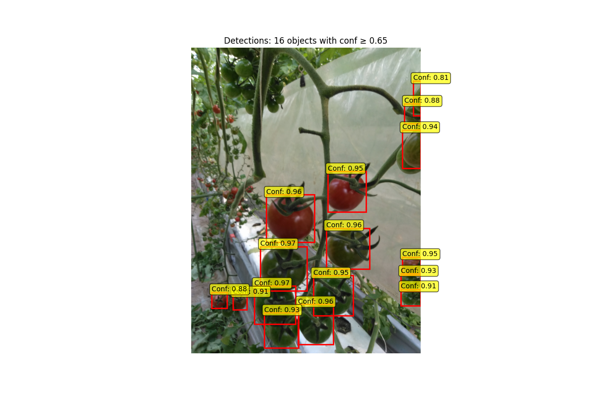

# Distilled Object Detection Pipeline

This project implements a **model distillation pipeline** that uses **Grounding DINO**  to automatically generate labeled datasets, then trains a smaller **YOLO model** on this generated data.  
The result is a lightweight, distilled object detector that can be run efficiently while retaining high accuracy.

---

## 📌 Features
- **Zero-shot detection** using [Grounding DINO](https://github.com/IDEA-Research/GroundingDINO) for initial bounding box generation.
- **Dataset creation** in YOLO format with automatic train/val split.
- **YOLO model training** using [Ultralytics YOLO](https://github.com/ultralytics/ultralytics) on the distilled dataset.
- **Visualization** of predictions with confidence threshold filtering.
- **Model export** to `.pt` for deployment.

---

## 📂 Project Structure
```
.
├── distill.py                  # Main pipeline: DINO detection  → YOLO training
├── ultralytics_try_distill.py  # Test script for running with the distilled YOLO model
├── distilled.yaml              # YOLO dataset configuration
├── requirements.txt            # Python dependencies
├── .gitignore                  # Ignored files and folders
└── datasets/                   # Auto-generated dataset (images & labels)
```

---

## ⚙️ Installation

1. **Clone the repository**  
   ```bash
   git clone https://github.com/eyalkaz/project.git
   cd project
   ```

2. **Install dependencies**  
   ```bash
   pip install -r requirements.txt
   ```

3. **(optional, if use tiny sam) Download TinySAM weights**  
   Place `tinysam.pth` into:
   ```
   TinySAM/weights/tinysam.pth
   ```

---

## 🚀 Usage

### 1. Run the distillation process
This will:
- Detect objects with Grounding DINO
- Create YOLO-format labels
- Train a YOLO model
```bash
python distill.py "tomato" path/to/images
```
- **`"tomato"`** → object class to detect (only single-class supported in current version)
- **`path/to/images`** → folder containing raw images (default: `images_for_dino`)

The trained model will be saved as:
```
distilized_model.pt
```

---

### 2. Test the distilled model
```bash
python ultralytics_try_distill.py
```
- Change the `image` variable inside the script to test on different images.
- Adjust `CONFIDENCE_THRESHOLD` in the script to filter low-confidence detections.

---

## 📊 Example Output
After training, inference with the distilled YOLO model produces bounding boxes with confidence scores:



---

## 🛠 Configuration

- **`debug` flag** in `distill.py`:
  - `True` → Uses existing dataset, skips DINO labeling.
  - `False` → Runs full pipeline, recreates dataset.
- **`parent_model_yolo11n.pt` model** in `distill.py` can be changed to any parent model  you want
- **`train_val_probability`** → Controls train/val split ratio.
- **`num_epoches`** → Number of YOLO training epochs.
- **`distilled.yaml`** → YOLO dataset config (classes, paths).

---

## 📦 Requirements
From `requirements.txt`:
```
ultralytics==8.3.174
timm
transformers
```

---

## 🔄 Alternative Pipeline: DINO + TinySAM

In addition to the default **DINO-only** pipeline (`distill.py`), there is an optional **DINO + TinySAM** version (`distill+SAM.py`) that adds segmentation masks using TinySAM for each detected object.

### Why use it?
- Visualize object masks in addition to bounding boxes
- Potentially refine dataset annotations (if mask data is needed)

### How to run DINO + TinySAM
1. **Clone TinySAM**
```bash
git clone https://github.com/xinghaochen/TinySAM.git
```

2. **Download weights**
Place `tinysam.pth` inside:
```
TinySAM/weights/tinysam.pth
```

3. **Ensure Python import works**
Keep the `TinySAM` folder in your project root or add it to `PYTHONPATH`:
```bash
export PYTHONPATH="${PYTHONPATH}:$(pwd)"
```

4. Run `distill+SAM.py` or `ultralytics_try_distill+SAM.py` from the drafts folder as described below.

### **distill+SAM.py**
```python
# this code also segment and save the results
for filename in os.listdir(test_dir):
   dino_boxes, masks, scores = detect_and_segment_image(filename, test_dir, model = distilized_model, dino = False) 
```
```bash
python distill+SAM.py "tomato" path/to/images
```
This will:
1. Detect objects with Grounding DINO
2. Train a YOLO model on the same YOLO-format labels as the DINO-only pipeline
3. Generate segmentation masks with TinySAM

The trained YOLO model will still be saved as:
```
distilized_model.pt
```

### **ultralytics_try_distill+SAM.py**
This will use your distilized_model.pt and show segmentation mask on the image

---

## 📜 License
This project combines components under different open-source licenses:

- **Ultralytics YOLO** – Licensed under the **GNU Affero General Public License v3.0 (AGPL-3.0)**  
  This is a strong copyleft license that requires any derivative works or software using this code (including over a network) to also be released under AGPL-3.0.
- **TinySAM** – Licensed under the **Apache License 2.0**  
  This license is permissive and compatible with AGPL-3.0.

Because AGPL-3.0 is more restrictive, the **overall repository is licensed under AGPL-3.0**.  
This means:
- If you modify or build upon this code and share it (including providing it as a hosted service), you must make the source code available under the AGPL-3.0 terms.
- You may still use and redistribute TinySAM code under its original Apache 2.0 license if kept separate.

- For full details, see the [GNU AGPL-3.0 license text](https://www.gnu.org/licenses/agpl-3.0.html) and the [Apache License 2.0 text](https://www.apache.org/licenses/LICENSE-2.0).
---